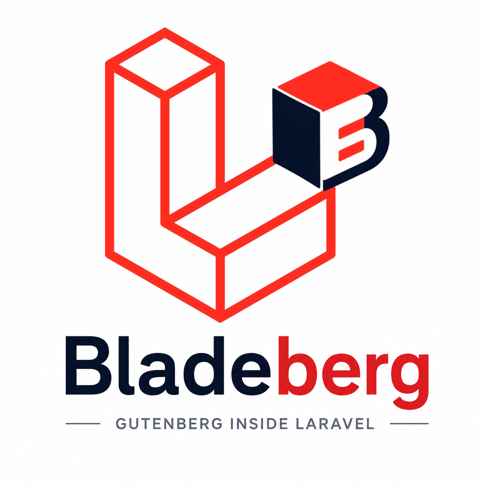
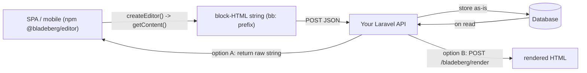

# BladeBerg



> **Gutenberg inside Laravel.** BladeBerg brings the WordPress block editor straight into your Laravel app — a rich, familiar authoring experience for your editors, while your back-end stays pure PHP/Blade. No WordPress install, no PHP-in-templates, no headless WP API.

<p>
  <a href="https://github.com/BladeBerg/bladeberg/blob/main/LICENSE"></a>
  
  
</p>

---

## Table of contents

- [Why BladeBerg?](#why-bladeberg)
- [How it works](#how-it-works)
- [Features](#features)
- [Requirements](#requirements)
- [Installation](#installation)
- [Quick start](#quick-start)
- [Configuration](#configuration)
- [The `bb:` block format & branding](#the-bb-block-format--branding)
- [Right-click block menu](#right-click-block-menu)
- [Storing & rendering content](#storing--rendering-content)
- [Headless / API usage (SPA, mobile, decoupled)](#headless--api-usage-spa-mobile-decoupled)
- [Building custom blocks](#building-custom-blocks)
- [Media manager](#media-manager)
- [PHP / Facade API](#php--facade-api)
- [JavaScript API](#javascript-api)
- [Updating](#updating)
- [Testing](#testing)
- [Roadmap](#roadmap)
- [Contributing](#contributing)
- [Reporting bugs & requesting features](#reporting-bugs--requesting-features)
- [Security](#security)
- [License](#license)
- [Credits](#credits)

---

## Why BladeBerg?

Laravel is a fantastic application framework, but it has no first-class **content editor**. Teams that need WordPress-style block authoring usually end up with one of three bad options:

1. **Run WordPress alongside Laravel** — two apps, two databases, two deploy pipelines, and a headless API glued in between.
2. **Ship a plain `<textarea>` / markdown field** — fast to build, miserable for non-technical editors.
3. **Adopt a heavyweight commercial page-builder** — proprietary, hard to theme, and locked to its own data format.

BladeBerg was built to remove that compromise. The Gutenberg block editor is the most widely-used block editor on the web, it is open-source (GPL), and — crucially — its editing UI can run completely standalone thanks to [`@automattic/isolated-block-editor`](https://github.com/Automattic/isolated-block-editor). BladeBerg wraps that standalone editor in a Laravel package so you get:

- the **exact Gutenberg editing experience** your authors already know,
- content stored as **portable block HTML** in your own database, on your own terms,
- a **pure PHP rendering pipeline** (a Blade component + a block parser) with no Node runtime in production,
- and a **Laravel-native** integration: config, service provider, facade, Artisan installer, Blade components, and your existing filesystem/auth.

### How the package came to be

BladeBerg started as a spike to answer one question: *“Can the Gutenberg editor be embedded in a Laravel Blade view without dragging in all of WordPress?”* The journey shaped most of the architecture decisions documented below:

- **Don't re-bundle `@wordpress/*` yourself.** Early attempts to bundle the individual `@wordpress/block-editor`, `@wordpress/data`, etc. packages hit unsolvable private-API / store-locking errors (`Cannot unlock an object that was not locked before`). The fix was to stop fighting it and ship the **pre-built `isolated-block-editor` browser bundle** as-is, with a thin React-globals + mount layer on top.
- **Store content under your own brand.** Gutenberg serializes blocks as `<!-- wp:paragraph -->`. BladeBerg rewrites that to a configurable prefix (default `<!-- bb:paragraph -->`) on the way out, and normalizes it back on the way in — so your database never leaks WordPress branding and the format is unmistakably yours.
- **Re-use Laravel's own storage.** The media manager scans the disk configured by your app's `FILESYSTEM_DISK` instead of inventing a parallel storage system or requiring extra tables.

It's still young software (pre-1.0) but it's already usable for real content. See the [roadmap](#roadmap) for what's next.

---

## How it works

```
┌─────────────────────────────────────────────────────────────────┐
│  Browser                                                          │
│                                                                   │
│  <x-bladeberg-editor name="content" />                            │
│        │                                                          │
│        ▼                                                          │
│  <textarea data-bladeberg-editor>  ← the real form field          │
│        │                                                          │
│   editor.jsx mounts the isolated-block-editor browser bundle      │
│   on the textarea, hides it, and keeps textarea.value in sync     │
│        │                                                          │
│   on submit: rewrite  <!-- wp:… -->  →  <!-- bb:… -->             │
└────────┼──────────────────────────────────────────────────────────┘
         │ POST content="<!-- bb:paragraph -->…"
         ▼
┌─────────────────────────────────────────────────────────────────┐
│  Laravel (PHP only)                                               │
│                                                                   │
│  store $request->input('content')  (already bb: prefixed)         │
│        │                                                          │
│        ▼                                                          │
│  <x-bladeberg-render :content="$post->content" />                 │
│        │                                                          │
│   BlockParser normalizes bb: → wp:, parses blocks,                │
│   renders core block HTML + your Blade views for dynamic blocks   │
└─────────────────────────────────────────────────────────────────┘
```

The key insight: **the editor is JavaScript, but rendering is pure PHP.** Your production servers never need Node — the compiled editor bundle is published once into `public/vendor/bladeberg/`.

---

## Features

- 🧱 **Full Gutenberg editing** — paragraphs, headings, lists, images, columns, quotes, embeds, and the rest of the core block library.
- 🖊️ **Drop-in Blade components** — `<x-bladeberg-editor>` to edit, `<x-bladeberg-render>` to display.
- 🏷️ **Configurable block prefix** — your content is saved as `<!-- bb:… -->` (or any prefix you choose), never `wp:`.
- 🎨 **Re-brandable & themable** — accent color and UI labels are CSS-variable driven; “WordPress/wp:” strings are rebranded in the UI.
- 🖱️ **Right-click block menu** — restores the context-menu → block Options behaviour the standalone bundle drops.
- 🗂️ **Optional media manager** — `disabled` / `link` / `select` / `upload` modes, backed by your existing Laravel filesystem disk (no extra tables) or Spatie Media Library.
- 🧩 **Headless-ready** — a separate `@bladeberg/editor` npm package mounts the editor in any SPA/mobile frontend; an optional render API turns stored content into HTML.
- ⚙️ **Laravel-native** — service-provider auto-discovery, publishable config, facade, and an Artisan installer.
- 🚀 **No Node in production** — the editor is pre-built and committed; servers only run PHP.
- ✅ **Tested** — PHPUnit suite covering the block parser and registry.

---

## Requirements

- PHP **8.2** or higher
- Laravel **10 / 11 / 12 / 13**

---

## Installation

```bash
composer require bladeberg/bladeberg
php artisan bladeberg:install
```

`bladeberg:install` will:

1. Publish the compiled editor assets to `public/vendor/bladeberg/`.
2. Publish the config file to `config/bladeberg.php`.
3. Print next-step guidance.

Prefer plain `vendor:publish`? The unified tag publishes the same set (assets + config):

```bash
php artisan vendor:publish --tag=bladeberg
```

Granular tags are also available: `bladeberg-assets`, `bladeberg-config`, `bladeberg-views`, `bladeberg-migrations`.

> **Heads up:** re-run `php artisan bladeberg:install` (or `php artisan vendor:publish --tag=bladeberg-assets --force`) after every package update so the published assets stay in sync with the installed version.

---

## Quick start

### 1. Add the editor to a create/edit form

```blade
<form action="{{ route('posts.store') }}" method="POST">
    @csrf

    <input type="text" name="title" placeholder="Title">

    <x-bladeberg-editor name="content" />

    <button type="submit">Publish</button>
</form>
```

### 2. Render the stored content on a show page

```blade
<x-bladeberg-render :content="$post->content" />
```

### 3. Re-open existing content for editing

```blade
<x-bladeberg-editor name="content" :value="$post->content" />
```

The editor re-hydrates the saved block HTML back into Gutenberg blocks automatically.

#### `<x-bladeberg-editor>` props

| Prop    | Type     | Default        | Description                                            |
|---------|----------|----------------|--------------------------------------------------------|
| `name`  | `string` | *(required)*   | The form field name posted to your controller.         |
| `value` | `string` | `''`           | Existing block HTML to load into the editor.           |
| `id`    | `string` | auto-generated | Custom DOM id for the underlying textarea.             |

A controller is just ordinary Laravel — the content arrives as a normal request field:

```php
public function store(Request $request)
{
    $request->validate(['content' => ['required', 'string']]);

    Post::create([
        'title'   => $request->string('title'),
        'content' => $request->input('content'), // already <!-- bb:… --> prefixed
    ]);

    return redirect()->route('posts.index');
}
```

---

## Configuration

Everything lives in `config/bladeberg.php` (published by the installer).

### Editor

| Key                 | Type            | Default  | Description                                                            |
|---------------------|-----------------|----------|------------------------------------------------------------------------|
| `block_prefix`      | `string`        | `'bb'`   | Prefix written into block comments on save. `env: BLADEBERG_BLOCK_PREFIX`. |
| `allowed_blocks`    | `array\|null`   | `null`   | Restrict the available blocks. `null` = allow all registered blocks.   |
| `has_fixed_toolbar` | `bool`          | `false`  | Pin the block toolbar to the top of the editor.                        |
| `align_wide`        | `bool`          | `true`   | Enable wide / full-width alignment for blocks that support it.         |
| `content_storage`   | `string`        | `'html'` | Storage format. Only `'html'` is supported today.                      |

**Example — restrict the block palette:**

```php
'allowed_blocks' => [
    'core/paragraph',
    'core/heading',
    'core/image',
    'core/list',
    'core/quote',
],
```

### Stylesheets

The `styles` array controls which pre-built CSS bundles the editor loads. The defaults are tuned to avoid version conflicts — only change them if you know you need to:

| Key             | Default | Loads                                                              |
|-----------------|---------|--------------------------------------------------------------------|
| `core`          | `true`  | Gutenberg editor chrome (toolbar, canvas, popovers).               |
| `iso`           | `true`  | `isolated-block-editor` layout shell.                              |
| `components`    | `false` | `@wordpress/components` (already inside `core.css`).               |
| `blocks_style`  | `false` | Per-block **frontend** styles (loaded independently by the renderer). |
| `blocks_editor` | `false` | Per-block **editor** styles (already inside `core.css`).           |

### Media

See the [Media manager](#media-manager) section for the full breakdown of the `media` block.

### Content normalization

A server-side safety net that mirrors the client-side `wp:` → `bb:` rewrite for requests that bypass the browser (AJAX, imports). See [Storing & rendering content](#storing--rendering-content).

---

## The `bb:` block format & branding

Gutenberg serializes blocks with a `wp:` prefix inside HTML comments:

```html
<!-- wp:paragraph --><p>Hello</p><!-- /wp:paragraph -->
```

BladeBerg rewrites this to **your** prefix before the content ever leaves the browser, and normalizes it back internally for parsing — so the round-trip is lossless:

```html
<!-- bb:paragraph --><p>Hello</p><!-- /bb:paragraph -->
```

This happens in two coordinated places:

1. **Client (on save)** — a form-submit interceptor in `editor.jsx` (and `window.Bladeberg.getContent()` for AJAX) rewrites `wp:` → your prefix in the textarea value just before the request is sent. This is the only place stored content is branded; nothing on the server rewrites it.
2. **Server (parsing only)** — `BlockParser` normalizes your prefix back to `wp:` at its entry point purely so it can render the blocks; it never changes what's stored.

Change the prefix per project:

```php
// config/bladeberg.php
'block_prefix' => 'acme',   // → <!-- acme:paragraph -->
```

```env
BLADEBERG_BLOCK_PREFIX=acme
```

The editor UI also rebrands visible “WordPress” / “WP” / `wp:` / `core/` strings (block validation notices, the Code Editor view, etc.) to your branding, and the accent color is driven by CSS variables in `resources/css/editor.scss` (shipped default: BladeBerg red `#e11d1f`).

---

## Right-click block menu

The standalone `isolated-block-editor` browser bundle (its final 2.30 release) ships **no** right-click context menu and exposes no data store to open one. BladeBerg restores the expected behaviour with a DOM-only handler:

- Right-clicking inside a block selects it and opens that block's existing **Options (⋮)** dropdown — Copy, Duplicate, Move to, Edit as HTML, Group, Lock, Remove, and so on.
- Right-clicking **outside** any editor block leaves the browser's native menu (spellcheck, etc.) untouched.

No configuration required — it's wired automatically when the editor mounts.

---

## Storing & rendering content

Store the posted `content` field as-is — it already carries your `bb:` prefix. The rewrite from Gutenberg's `wp:` to your configured prefix happens **entirely on the client**, at save time: the editor's form-submit interceptor (and `window.Bladeberg.getContent()` for AJAX) rewrites the markup before it leaves the browser. There is no server-side middleware to register and nothing rewrites your stored content after the fact.

```php
// Your controller is plain Laravel — content arrives already bb:-prefixed.
$post->content = $request->input('content');
```

To render it, use the component:

```blade
<x-bladeberg-render :content="$post->content" />
```

> **Importing or pasting existing content?** Handle any prefix conversion on the client. When you load saved content back into the editor via `:value`, BladeBerg converts your prefix to `wp:` on mount so Gutenberg can parse it, then converts it back to your prefix on save. Pasted block markup is serialized by the editor and rewritten on submit the same way.

---

## Headless / API usage (SPA, mobile, decoupled)

The Blade quick-start above is the simplest path, but BladeBerg also works when your frontend is a separate SPA (React, Vue, Next), a mobile webview, or anything that talks to Laravel over JSON. **You do not need a second repository** — the same project ships two artifacts:

| Artifact | Registry | Install | Use |
|----------|----------|---------|-----|
| `bladeberg/bladeberg` | Packagist | `composer require bladeberg/bladeberg` | PHP: parse, render, dynamic blocks, media + render APIs |
| `@bladeberg/editor` | npm | `npm i @bladeberg/editor react react-dom` | JS: mount the editor anywhere, headless |

The only contract between them is **a string of block HTML with your configured prefix**. The frontend produces it; the backend parses/renders it.



### Mount the editor (no Blade, no form)

```js
import { createEditor } from '@bladeberg/editor';
import '@bladeberg/editor/style.css';

const editor = await createEditor({
  target: '#editor',          // selector or element (textarea or any container)
  value: post.content,        // stored content (your configured prefix); optional
  blockPrefix: 'bb',          // must match the backend config
  onChange: (html) => { draft = html; },   // optional live updates
  media: {                    // optional; omit to disable media
    mode: 'upload',           // 'disabled' | 'select' | 'upload'
    apiUrl: '/bladeberg/media',
    csrfToken: window.csrfToken,
  },
});

// When the user saves:
await fetch('/api/posts', {
  method: 'POST',
  headers: { 'Content-Type': 'application/json' },
  body: JSON.stringify({ content: editor.getContent() }),
});

// On teardown (SPA route change, unmount):
editor.destroy();
```

`createEditor()` is async because it lazy-loads the Gutenberg runtime on first use. `react` and `react-dom` are peer dependencies — your app's copies are reused.

### Render stored content for a headless backend

Server-rendered Blade apps just use `<x-bladeberg-render>`. Headless backends have two choices:

- **Return the raw string** and render it in the SPA yourself, or
- **Enable the render API** and let Laravel return finished HTML:

```php
// config/bladeberg.php
'render_api' => ['enabled' => true, 'middleware' => ['api']],
```

```
POST /bladeberg/render   { "content": "<!-- bb:paragraph -->..." }
     -> { "html": "<div class=\"bb-content\">...</div>" }
```

Or render in-process from any controller/job via the facade:

```php
$html = Bladeberg::render($post->content);
```

> **SSR note:** the package loads a browser-only Gutenberg bundle, so in Next.js/Nuxt import it from a client component (`'use client'` / dynamic `import()` with `ssr: false`).

---

## Building custom blocks

There are two conceptual ways to extend a Gutenberg-style editor with your own blocks. BladeBerg fully supports one of them today; the other is constrained by the standalone editor bundle. Here's the honest picture:

| Approach | "bb-style" — server-rendered | "wp-style" — editor (React) block |
|----------|------------------------------|-----------------------------------|
| Renders via | **PHP / Blade** on the server | **React** inside the editor canvas |
| Editor UI | Re-uses an existing block's editing UI (often `core/html`, `core/group`, or a core block you map) | A bespoke `edit()` / `save()` React component |
| Registered with | `Bladeberg::registerDynamicBlock()` (PHP) | `registerBlockType()` (JS) |
| Status | ✅ **Supported now** | 🧪 **Not yet** — see the limitation below |
| Best for | data-aware output, server logic, Blade reuse | rich custom in-canvas editing |

> **Why no custom React blocks yet?** BladeBerg embeds the pre-built `@automattic/isolated-block-editor` browser bundle (v2.30, its final release). That bundle only exposes `window.wp.attachEditor` / `window.wp.detachEditor` — it does **not** expose the `wp.blocks` / `wp.element` / `wp.blockEditor` registration APIs. Without them, custom `edit`/`save` components can't be registered from your app's JS. `window.Bladeberg.registerBlock()` exists and queues calls for the day that becomes possible, but the queue currently does not flush. This is tracked on the [roadmap](#roadmap). **For now, server-rendered blocks below are the supported path.**

### bb-style: server-rendered dynamic blocks (recommended)

You map a **block name** to a **Blade view**. When `<x-bladeberg-render>` encounters that block in the stored content, it renders your view instead of the raw HTML — ideal for data-aware components (a related-posts list, a pricing table, a CTA pulled from config).

The block name can be one you author (e.g. `bladeberg/callout`) or even an existing core block whose output you want to take over.

#### Step 1 — map the block name to a view

```php
// app/Providers/AppServiceProvider.php
use Bladeberg\Facades\Bladeberg;

public function boot(): void
{
    Bladeberg::registerDynamicBlock('bladeberg/callout', 'blocks.callout');
}
```

#### Step 2 — create the Blade view

```blade
{{-- resources/views/blocks/callout.blade.php --}}
@php($type = $attributes['type'] ?? 'info')

<div class="callout callout--{{ $type }}">
    {!! $innerContent !!}
</div>
```

Variables available in the view:

| Variable        | Type      | Description                          |
|-----------------|-----------|--------------------------------------|
| `$attributes`   | `array`   | Block attributes from the editor (the JSON in the block comment). |
| `$innerContent` | `string`  | Rendered inner HTML.                 |
| `$innerBlocks`  | `Block[]` | Parsed child blocks.                 |
| `$block`        | `Block`   | The full `Block` value object.       |

The `Block` value object exposes `isNamed()`, `hasInnerBlocks()`, `getAttribute($key, $default)`, and the `$isSelfClosing` flag — handy for rendering nested content:

```blade
{{-- a block that renders its children explicitly --}}
@foreach ($innerBlocks as $child)
    @if ($child->getAttribute('featured'))
        <strong>{!! $child->innerHTML !!}</strong>
    @else
        {!! $child->innerHTML !!}
    @endif
@endforeach
```

#### How the block gets into content

Until custom React blocks are available, there's no inserter button for a server-only block. You get the block comment into the stored content one of two ways:

1. **Code Editor** — switch the editor to Code Editor mode and paste the block comment directly. Gutenberg preserves unrecognized block markup on save, so it round-trips intact:

```html
<!-- bb:bladeberg/callout {"type":"warning"} -->
<p>Heads up — this is a server-rendered callout.</p>
<!-- /bb:bladeberg/callout -->
```

2. **Pre-seed it server-side** — set the field's initial value (e.g. from a template) when rendering the editor: `<x-bladeberg-editor name="content" :value="$template" />`.

Either way, on display `<x-bladeberg-render>` routes the `bladeberg/callout` block to `resources/views/blocks/callout.blade.php`.

### wp-style: custom editor (React) blocks

Not available with the current editor bundle (see the limitation note above). When the bundle gains a registration API, `window.Bladeberg.registerBlock(name, settings)` will register a standard Gutenberg block type — see the [JavaScript API](#javascript-api). Until then, prefer server-rendered blocks, and use [`allowed_blocks`](#editor) to curate which core blocks authors can use.

---

## Media manager

BladeBerg ships an optional media manager that wires into Gutenberg's image / file / gallery blocks. It is **disabled by default** and, by design, re-uses the storage your Laravel app already configures.

### Modes

Set `media.mode` (env: `BLADEBERG_MEDIA_MODE`):

| Mode       | Behaviour                                                                                  | API routes              |
|------------|--------------------------------------------------------------------------------------------|-------------------------|
| `disabled` | No media integration. Blocks fall back to a plain URL input. *(default)*                   | none                    |
| `link`     | Same as `disabled` server-side (reserved for a future URL-picker).                         | none                    |
| `select`   | Browse and insert files already on the disk. **Upload disabled.**                          | `GET` only              |
| `upload`   | Full library: browse existing files **and** upload new ones.                               | `GET` + `POST` + `DELETE` |

### Drivers

| Driver       | Requires                              | Notes                                                                              |
|--------------|---------------------------------------|------------------------------------------------------------------------------------|
| `filesystem` | nothing *(default)*                   | Scans the configured disk directory directly. **No database table or migration.**  |
| `spatie`     | `composer require spatie/laravel-medialibrary` | Automatic thumbnails/conversions and multi-disk management.               |

### Configuration

```php
// config/bladeberg.php
'media' => [
    'mode'      => env('BLADEBERG_MEDIA_MODE', 'disabled'),       // disabled|link|select|upload
    'driver'    => env('BLADEBERG_MEDIA_DRIVER', 'filesystem'),   // filesystem|spatie
    'disk'      => env('BLADEBERG_MEDIA_DISK', env('FILESYSTEM_DISK', 'public')),
    'directory' => env('BLADEBERG_MEDIA_DIRECTORY', 'bladeberg'),
    'route_prefix'     => 'bladeberg',          // → /bladeberg/media
    'middleware'       => ['web', 'auth'],
    'max_file_size_kb' => 10240,                // 10 MB
    'allowed_mime_types' => [/* images, video, audio, pdf … */],
    'conversions' => [                          // spatie driver only
        'thumbnail' => ['width' => 300, 'height' => 300],
        'medium'    => ['width' => 768,  'height' => null],
        'large'     => ['width' => 1200, 'height' => null],
    ],
],
```

> Because `disk` defaults to your app's `FILESYSTEM_DISK`, BladeBerg stores media exactly where the rest of your application does — no separate storage setup. Run `php artisan storage:link` if you're using the `public` disk.

### Filesystem driver — minimal setup

```bash
php artisan storage:link
```

```php
'media' => ['mode' => 'upload', 'driver' => 'filesystem'],
```

### Spatie driver — setup

```bash
composer require spatie/laravel-medialibrary
php artisan vendor:publish --provider="Spatie\MediaLibrary\MediaLibraryServiceProvider" --tag="medialibrary-migrations"
php artisan migrate
php artisan storage:link
```

```php
'media' => ['mode' => 'upload', 'driver' => 'spatie'],
```

### API endpoints

When `mode` is `select` or `upload`, the following JSON routes are registered under `media.route_prefix`:

| Method   | URL                       | Modes            | Description                          |
|----------|---------------------------|------------------|--------------------------------------|
| `GET`    | `/bladeberg/media`        | select, upload   | List media (paginated, searchable).  |
| `GET`    | `/bladeberg/media/{id}`   | select, upload   | Single attachment.                   |
| `POST`   | `/bladeberg/media`        | upload only      | Upload a file (`multipart/form-data`). |
| `DELETE` | `/bladeberg/media/{id}`   | upload only      | Delete attachment + file.            |

Query parameters for the list endpoint: `page`, `per_page`, `search`, `media_type` (`image` / `video` / `audio` / `application`).

---

## PHP / Facade API

```php
use Bladeberg\Facades\Bladeberg;

// Dynamic block registration (server-rendered)
Bladeberg::registerDynamicBlock('bladeberg/hero', 'blocks.hero');
Bladeberg::isDynamicBlock('bladeberg/hero');       // true
Bladeberg::hasBlock('bladeberg/hero');             // alias of isDynamicBlock()
Bladeberg::getDynamicBlockView('bladeberg/hero');  // 'blocks.hero'
Bladeberg::getRegisteredBlocks();                  // ['bladeberg/hero' => 'blocks.hero', …]

// Render stored block content to HTML (same output as <x-bladeberg-render>).
// Useful for JSON render endpoints, queued jobs, feeds, sitemaps, etc.
Bladeberg::render($post->content);                 // '<div class="bb-content">…</div>'
```

> Block-comment prefix rewriting (`wp:` ↔ your prefix) is handled on the client at save time — there is no server-side conversion helper or middleware. Stored content always uses your configured prefix.

---

## JavaScript API

### Blade integration (global `window.Bladeberg`)

When loaded via the Blade component, BladeBerg exposes a small global surface:

```js
// Get the current block content for a field, already bb:-prefixed
// (handy for AJAX submits instead of a native <form>).
const content = window.Bladeberg.getContent('content');
fetch('/posts', { method: 'POST', body: JSON.stringify({ content }) });

// Programmatic mount (same as the npm createEditor — see "Headless / API usage").
const editor = await window.Bladeberg.createEditor({ target: '#editor' });
```

### Headless / npm (`@bladeberg/editor`)

```js
import { createEditor, registerBlock } from '@bladeberg/editor';
import '@bladeberg/editor/style.css';

const editor = await createEditor({ target: '#editor', value, onChange });
editor.getContent();   // branded block-HTML string
editor.destroy();      // detach + stop listeners
```

See [Headless / API usage](#headless--api-usage-spa-mobile-decoupled) for the full round-trip.

```js
// RESERVED — not functional with the current editor bundle.
// The shipped isolated-block-editor build does not expose window.wp.blocks,
// so this call is queued but never flushes. It is kept as forward-compatible
// API surface; use server-rendered blocks instead (see "Building custom blocks").
registerBlock('bladeberg/callout', { /* block settings */ });
```

In the Blade build, `window.React` and `window.ReactDOM` are also published (the editor bundle declares them as externals).

---

## Updating

```bash
composer update bladeberg/bladeberg
php artisan bladeberg:install        # or: vendor:publish --tag=bladeberg-assets --force
php artisan view:clear
php artisan config:clear
```

Then hard-refresh the browser (Ctrl/Cmd + Shift + R) so the cached editor bundle is replaced.

---

## Testing

```bash
# Package unit tests (run from packages/bladeberg/)
composer test

# Your application's feature tests
php artisan test
```

---

## Roadmap

- [ ] First-class custom editor blocks (stable `wp.blocks` exposure).
- [ ] `link` media mode URL-picker UI.
- [ ] JSON content storage format.
- [ ] More built-in dynamic block examples.
- [ ] Publishing to Packagist.

Have an idea? [Open a feature request](https://github.com/BladeBerg/bladeberg/issues/new).

---

## Contributing

Contributions are very welcome! See [CONTRIBUTING.md](CONTRIBUTING.md) for the full guide. In short:

```bash
git clone https://github.com/BladeBerg/bladeberg.git
cd bladeberg
composer install        # PHP deps
npm install             # editor build deps
npm run build           # build the editor bundle into dist/
composer test           # run the PHP test suite
```

1. Fork the repo and branch from `main`.
2. Add or update tests for your change.
3. Run `composer test` (and `npm run build` if you touched any JS).
4. Note your change under `[Unreleased]` in [CHANGELOG.md](CHANGELOG.md).
5. Open a pull request with a clear before/after description.

---

## Reporting bugs & requesting features

Please use the **GitHub issue tracker**: <https://github.com/BladeBerg/bladeberg/issues>

When reporting a bug, include:

- PHP and Laravel versions,
- the installed BladeBerg version,
- clear steps to reproduce,
- expected vs. actual behaviour,
- any console errors (browser dev-tools) and relevant `storage/logs/laravel.log` output.

For feature requests, describe the problem you're trying to solve — not just the solution you have in mind.

---

## Security

If you discover a security vulnerability, please **do not** open a public issue. Email `security@bladeberg.dev` (or open a private GitHub security advisory) so it can be addressed before disclosure.

---

## License

BladeBerg is open-source software licensed under the **GNU General Public License v2.0 (or later)** — see [LICENSE](LICENSE).

This license was chosen deliberately: BladeBerg embeds the WordPress/Gutenberg block editor, which is itself GPL-2.0-or-later. Distributing under the same license keeps BladeBerg fully compatible with the code it builds on.

```
Copyright (C) 2026 BladeBerg

This program is free software; you can redistribute it and/or modify it under
the terms of the GNU General Public License as published by the Free Software
Foundation; either version 2 of the License, or (at your option) any later
version.
```

---

## Credits

- [Gutenberg](https://github.com/WordPress/gutenberg) and [`@automattic/isolated-block-editor`](https://github.com/Automattic/isolated-block-editor) — the editor BladeBerg stands on.
- [Laravel](https://laravel.com) — the framework that makes it feel at home.
- Everyone who [contributes](CONTRIBUTING.md) to BladeBerg.
